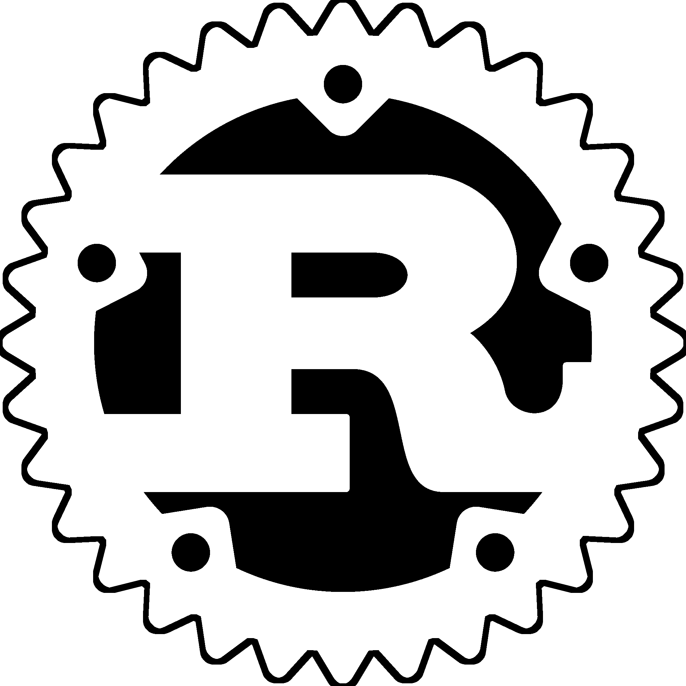

  ## 👋🏻 Hey! I'm King.
  I build tools and creative infrastructure around **Minecraft**. ✨

I enjoy exploring how things work, taking them apart,
and building new ideas from what I discover.

 

  
  ## 🛠 Languages & Tools

  
  
  
  
  
  
  
  
  
  
  
  

<!---
xKingDark/xKingDark is a ✨ special ✨ repository because its `README.md` (this file) appears on your GitHub profile.
You can click the Preview link to take a look at your changes.
--->
